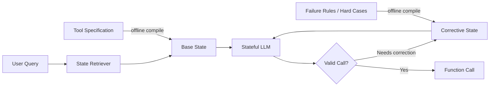

<div align="center">

# EngramState

### Compile tool knowledge once. Recall it instantly.

**Reusable recurrent states for fast, memory-efficient on-device tool calling.**

[Project Page](https://agent-sk.github.io/ES/) · [Demo](#mobile-demo) · [Method](#how-it-works) · [Results](#key-results) · [Blog](./docs/blog/)

</div>

---

## Overview

Modern function-calling systems repeatedly prefill long tool specifications before answering even a short user request. On mobile hardware, that repeated context processing can dominate time-to-first-token and make local agents unnecessarily expensive.

**EngramState** moves reusable tool knowledge out of the runtime prompt. Tool specifications are compiled offline into reusable recurrent states, retrieved from the live user query, and loaded directly into a stateful language model at inference time.

```text
Prompt-based tool calling
User Query + Tool Specifications ──> Long Prefill ──> Function Call

EngramState
User Query ──> State Retriever ──> Load Reusable State ──> Function Call
```

The result is a much smaller live prompt and a substantially shorter path to the first generated token.

## Key Results

Representative results with **RWKV-7 1.5B on DroidCall**:

| | Prompt baseline | EngramState |
|---|---:|---:|
| Prompt tokens | 985 | **22** |
| TTFT | 7.301 s | **0.259 s** |
| Prompt reduction | — | **97.8% ↓** |
| TTFT speedup | — | **28.2×** |
| Quantized state storage | — | **6.19 MiB / tool** |

EngramState preserves the task information that normally lives in long tool prompts while removing that repeated text from the online inference path.

## How It Works

EngramState separates tool knowledge into two reusable states:

- **Base State** — the canonical tool specification: name, description, arguments, value formats, and representative examples.
- **Corrective State** — compact knowledge about failure modes and difficult cases, used only when the base attempt requires correction.

A lightweight **State Retriever** maps the user query to candidate tool states. Each candidate is loaded directly into the recurrent model state, allowing inference to begin from the user query rather than from a long concatenated tool prompt.



### Runtime path

1. Encode the user query.
2. Retrieve the Top-K candidate tool states.
3. Load the candidate Base State and generate a function call.
4. If needed, retry with its Corrective State or continue to the next candidate.
5. Execute the validated function call.

## Why Recurrent States?

For a stateful backbone, a long static tool description can be consumed once and compressed into the model's recurrent state. That state can then be stored and reused across future requests.

This changes the runtime cost profile:

- **Prompt baseline:** repeated text prefill grows with tool-spec length.
- **EngramState:** tool knowledge is compiled once; runtime processes primarily the live query.
- **On-device deployment:** states can be quantized and loaded selectively instead of keeping every tool prompt in the active context.

## State Storage

EngramState uses **4-bit per-channel linear quantization** for Base and Corrective states.

For RWKV-7 1.5B:

- FP16 Base + Corrective state: **24.76 MiB / tool**
- 4-bit Base + Corrective state: **6.19 MiB / tool**

The 4-bit representation is chosen as a practical mobile storage format while preserving accuracy in our experiments.

## State Retrieval

The retriever is designed to remain small relative to conventional text-embedding retrieval stacks. In scaling experiments up to **206 tools**, the State Retriever reaches **0.956 Hit@4** while keeping tool-embedding storage compact.

The candidate list is also reused across retries and multi-call execution rather than restarting retrieval for every attempt.

## Mobile Demo

The accompanying Android demo is designed to make the runtime difference visible instead of presenting only benchmark tables.

Example:

```text
"Set a timer for 20 minutes."
          │
          ▼
   State Retriever
          │
          ▼
    timer Base State
          │
          ▼
 set_timer(minutes=20)
          │
          ▼
   Android device action
```

The demo will expose:

- retrieved tool/state
- Base → Corrective retry path
- generated function call
- prompt tokens
- TTFT
- actual Android action
- Prompt vs. EngramState comparison

Android source will live under `demo/android/` once it is added.

## Repository Layout

```text
ES/
├── README.md
├── engramstate/          # Core implementation
│   ├── compiler.py
│   ├── retriever.py
│   ├── quantization.py
│   └── inference.py
├── eval/                 # DroidCall / benchmark evaluation
├── examples/             # Minimal tool specs and queries
├── demo/
│   └── android/          # On-device demo application
├── assets/               # Figures, GIFs, screenshots
└── docs/                 # Project website + technical notes
    ├── index.html
    ├── style.css
    ├── script.js
    └── blog/
```

> The implementation directories above are the intended public layout. Source code will be added separately.

## Quick Start

Coming with the code release. The intended flow will be:

```bash
# 1. Compile reusable states from tool specifications
python -m engramstate.compile --tools examples/tools.json

# 2. Run state-based tool calling
python -m engramstate.run --query "Set a timer for 20 minutes"

# 3. Evaluate
python -m eval.droidcall
```

Exact commands may change before the source release.

## Project Page & Technical Notes

The project website lives in [`docs/`](./docs/) and is prepared for GitHub Pages. It includes a visual method walkthrough, benchmark summary, interactive demo mockup, and a small technical blog.

## Paper

Paper metadata and the public PDF link will be added at release.

## Citation

BibTeX will be added with the public paper release.

## License

No open-source license has been selected yet. Please do not redistribute or reuse the implementation until a license is explicitly added.
