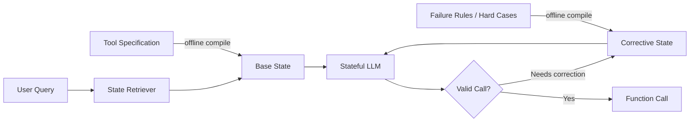

<div align="center">


# EngramState

### Load memory, not prompts.

**Reusable recurrent states for fast, memory-efficient, fully on-device LLM function calling.**

EngramState compiles static tool specifications into reusable recurrent states, retrieves the right state from a live query, and loads it directly into a stateful language model. In our mobile evaluation, the model runs locally on a **Samsung Galaxy S25 Ultra** and reaches the tool call without remote model serving in the measured execution path.

[Project Page](https://agent-sk.github.io/ES/) · [Interactive Demo](https://agent-sk.github.io/ES/#demo) · [Technical Blog](./docs/blog/) · [Method](#how-it-works) · [Results](#key-results)

</div>

---

## Why EngramState?

Modern function-calling systems often retrieve relevant tools and then concatenate their textual specifications into the runtime prompt. That means the model repeatedly rereads static information—tool names, descriptions, argument schemas, constraints, value formats, and examples—even when only the user query changed.

EngramState moves that reusable knowledge **out of the critical runtime prompt**.

### A concrete example

Suppose the user asks:

> **“Set a timer for 20 minutes.”**

A conventional function-calling prompt may include a tool specification like this before the model can answer:

```yaml
name: set_timer
description: Start a countdown timer on the device.
arguments:
  minutes:
    type: integer
    required: true
  seconds:
    type: integer
    required: false
constraints:
  - Preserve the user's requested duration.
  - Reject negative values.
  - Normalize minutes and seconds when needed.
examples:
  - user: "Set a timer for 5 minutes."
    call: set_timer(minutes=5)
  - user: "Set a timer for 90 seconds."
    call: set_timer(minutes=1, seconds=30)
```

And that is only **one** tool. A real agent prompt may concatenate the corresponding specifications for alarms, calendars, messaging, weather, settings, and many other tools.

#### Prompt baseline — repeated at runtime

```text
User Query
+ set_timer specification
+ set_alarm specification
+ create_event specification
+ ... other tool specifications ...
────────────────────────────────────
Long Prefill
────────────────────────────────────
set_timer(minutes=20)
```

#### EngramState — compile once, load at runtime

```text
OFFLINE
set_timer specification ──> timer_base.state

RUNTIME
"Set a timer for 20 minutes."
        │
        ├──> State Retriever
        ├──> load timer_base.state
        └──> set_timer(minutes=20)
```

The detailed tool specification is reusable knowledge. Prompt-based inference pays the text-processing cost again for every request; EngramState compiles it once and restores the resulting recurrent state when the tool is needed.

## Key Results

Representative results with **RWKV-7 1.5B on DroidCall**:

| | Prompt baseline | EngramState |
|---|---:|---:|
| Prompt tokens | 985 | **22** |
| TTFT | 7.301 s | **0.259 s** |
| Prompt reduction | — | **97.8% ↓** |
| TTFT speedup | — | **28.2×** |
| Quantized state storage | — | **6.19 MiB / tool** |

### Real-device evaluation

We evaluate deployment behavior on a **Samsung Galaxy S25 Ultra** with the model executing on device. This is important: the reported mobile behavior is not a cloud API latency measurement dressed up as a mobile demo. The measured execution path performs local model inference and local state loading on the phone.

The retry analysis is especially revealing. With Top-4 retrieval, a single-call EngramState request has at most five attempts (initial + four retries). Even its **single-call worst-case cumulative latency of 8.204 s** remains below the **9.047 s** required by one initial Prompt (Top-4) attempt in the corresponding mobile measurement.

| Retry path | EngramState cumulative E2E | Prompt cumulative E2E |
|---|---:|---:|
| Initial | 1.595 s | 9.047 s |
| 1 retry | 3.202 s | 19.248 s |
| 4 retries / ES single-call worst case | **8.204 s** | 56.540 s |
| 7 retries / ES multi-call worst case | **13.126 s** | 94.347 s |

## How It Works

EngramState separates tool knowledge into two reusable states:

- **Base State** — canonical tool knowledge: tool name, description, argument schema, value formats, and representative examples.
- **Corrective State** — failure-oriented knowledge: hard cases, format rules, confusing values, and corrective examples.

A lightweight **State Retriever** maps the user query to candidate tool states. Each candidate is loaded directly into the recurrent model state, allowing inference to begin from the live query rather than from a long concatenated tool prompt.



### Retention-aware state construction

The Base/Corrective boundary is calibrated rather than chosen arbitrarily. We progressively add sections of tool information and measure function-calling accuracy on **200 single-call calibration examples**. The first point where calibration accuracy reaches its maximum is used as the boundary. Later sections become corrective knowledge if they do not improve—or begin to reduce—the common-path accuracy.

State compilation itself is simple:

1. tokenize the selected tool-spec sections,
2. run a **single forward pass** through a frozen stateful backbone,
3. retain the final recurrent state,
4. discard logits,
5. perform **no gradient computation, backpropagation, or parameter update**.

For RWKV-7, a saved state includes the time-mixing token-shift state, WKV recurrent state, and channel-mixing token-shift state from every layer.

## Why Stateful Models?

EngramState fundamentally targets fixed-size recurrent/state-space backbones such as **RWKV and Mamba**. A Transformer analogue can use prefix/KV caching, but its stored cache grows with prompt length.

For an 800–1,000-token tool description, a 1B-scale Transformer example requires roughly **50–62.5 MiB of KV cache per tool**, whereas a recurrent state has fixed shape regardless of how long the original tool description was. This fixed-size property makes recurrent state artifacts easier to store, retrieve, quantize, and manage on device.

## State Compression

EngramState applies **4-bit per-channel linear quantization** to stored recurrent states.

For RWKV-7 1.5B, Base + Corrective storage is approximately:

- FP16: **24.76 MiB / tool**
- 4-bit: **6.19 MiB / tool**

We also tested lower precision. Three-bit channel-wise quantization stayed within **1.3 percentage points** of the baseline in the reported experiments, while naïve RTN and outlier-scaling approaches degraded much more sharply. Four bits are used as the default for practical deployment because they are byte-friendly (two 4-bit values per byte) and easier to support in existing mobile inference stacks.

## Retriever and Scaling

EngramState does **not** load the entire tool repository during inference. The retriever selects Top-K candidates, and one candidate state is loaded per attempt. The cost of a single state-loading/execution step is therefore independent of the total number of tools.

Retriever scaling results:

| Tools | Hit@1 | Hit@4 | Tool embeddings | Total retriever memory |
|---:|---:|---:|---:|---:|
| 24 | 0.9833 | 0.9950 | 12.0 KiB | 8.26 MiB |
| 50 | 0.9440 | 0.9929 | 25.0 KiB | 8.28 MiB |
| 100 | 0.8990 | 0.9850 | 50.0 KiB | 8.30 MiB |
| 206 | 0.8576 | **0.9563** | 103.0 KiB | 8.36 MiB |

At 100 tools, the similarity + Top-K scan itself measured only **0.0304 ms** out of **24.1 ms** total retrieval time in the reported setup.

## End-to-End Retriever Quality

Retriever accuracy matters because the retrieved tool determines what state enters the function-calling path. We therefore evaluate retrievers inside the complete system rather than only reporting Hit@K.

| Retriever | Hit@1 | Hit@4 | Acc. | Soft Acc. | TTFT | Avg. calls | Storage |
|---|---:|---:|---:|---:|---:|---:|---:|
| Oracle | 1.000 | 1.000 | 0.785 | 0.896 | 0.0371 s | 1.73 | 0 MiB |
| **EngramState State Retriever** | **0.940** | **0.995** | **0.740** | **0.848** | 0.0610 s | **1.77** | **8.24 MiB** |
| MPNet, fine-tuned | 0.940 | 0.990 | 0.740 | 0.840 | 0.0500 s | 1.81 | 417.66 MiB |
| BGE-base-en, fine-tuned | 0.935 | 0.995 | 0.730 | 0.835 | 0.0493 s | 1.86 | 417.64 MiB |
| MiniLM-L6, fine-tuned | 0.920 | 0.990 | 0.725 | 0.835 | 0.0462 s | 1.83 | 86.64 MiB |

The point is not that retrieval errors disappear; they do not. The practical advantage is that a small state-based retriever can preserve strong end-to-end behavior without adding a large embedding backbone to an already constrained mobile stack.

## Offline Cost

EngramState shifts static work from online inference to preparation time. We measure that cost explicitly.

State compilation time per state on a single NVIDIA RTX 3090:

| Backbone | Time / state |
|---|---:|
| RWKV-7 0.1B | 0.033 s |
| RWKV-7 0.4B | 0.075 s |
| RWKV-7 1.5B | **0.140 s** |
| RWKV-7 2.9B | 0.247 s |

For RWKV-7 1.5B, compiling both Base + Corrective states for one tool takes roughly **0.28 s**. Preparing all 48 states for the 24-tool DroidCall repository takes about **6.72 s**.

## Dynamic Tool Updates

Tool repositories change. EngramState supports tool-level incremental updates:

- **Updated tool** → recompile only that tool's Base + Corrective states (~0.28 s for RWKV-7 1.5B).
- **New tool** → compile its states; keep existing states unchanged; update the retriever with new-tool data.
- **Deleted tool** → remove its states and retriever entry.

Changing the backbone is different: recurrent states are model-specific because layer count and state dimensions differ, so states must be recompiled for the new backbone.

## Multi-Tool Execution

We explored two strategies beyond independent per-tool retrieval.

| Method | Soft Acc. | Exact Acc. |
|---|---:|---:|
| Jointly compiled multi-tool state | 0.825 | 0.700 |
| Query decomposition + sequential state loading | **0.904** | **0.795** |

Jointly compiling common tool combinations works, but the number of combinations grows combinatorially. The current design therefore stores independent tool states and traverses the same Top-K candidate list across calls. Query decomposition is a promising path for more complex multi-step requests.

## Structured Decoding Compatibility

EngramState can be combined with schema-constrained decoding. In an experiment where the required output format was changed to JSON without additional syntax training:

| Method | Decoding | Valid JSON | Accuracy |
|---|---|---:|---:|
| Prompt (Top-4) | Free | 0.200 | 0.125 |
| Prompt (Top-4) | XGrammar2 | 0.990 | 0.595 |
| EngramState | Free | 0.645 | 0.410 |
| **EngramState** | **XGrammar2** | **0.980** | **0.615** |

This suggests a clean division of labor: reusable state supplies semantic tool knowledge; structured decoding can enforce output syntax when the required format changes.

## Android Demo

The Android demo is designed to make the latency difference visible rather than presenting only benchmark tables.

```text
"Set a timer for 20 minutes."
          │
          ▼
   State Retriever
          │
          ▼
    timer Base State
          │
          ▼
 set_timer(minutes=20)
          │
          ▼
   Android device action
```

The demo will expose retrieved state, Base → Corrective routing, generated function call, prompt tokens, TTFT, and the actual Android action.

## Technical Blog

The [technical blog](./docs/blog/) expands on design and deployment questions that do not fit cleanly into a short project README:

- why repeated tool prompts dominate mobile latency,
- how Base/Corrective boundaries are calibrated,
- state tensor compilation and quantization,
- scaling from 24 to 206 tools,
- end-to-end retriever trade-offs,
- offline preparation cost,
- Galaxy S25 Ultra worst-case retry behavior,
- dynamic tool updates,
- multi-tool composition,
- XGrammar2 integration,
- 3-bit/2-bit compression limits.

## Repository Layout

```text
ES/
├── README.md
├── engramstate/          # Core implementation
├── eval/                 # DroidCall / benchmark evaluation
├── examples/             # Minimal tool specs and queries
├── demo/android/         # On-device demo application
├── assets/               # Figures, GIFs, screenshots
└── docs/                 # Project website + technical blog
```

> Source code will be added separately.

## Quick Start

Coming with the code release.

```bash
python -m engramstate.compile --tools examples/tools.json
python -m engramstate.run --query "Set a timer for 20 minutes"
python -m eval.droidcall
```

## Paper

Paper metadata and the public PDF link will be added at release.

## Citation

BibTeX will be added with the public paper release.

## License

No open-source license has been selected yet. Please do not redistribute or reuse the implementation until a license is explicitly added.
